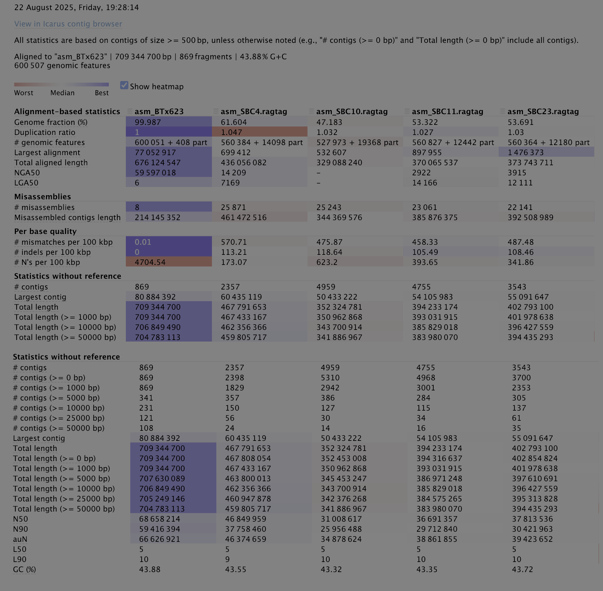

# Variant analysis pipeline
## Strategy
Currently, there 4 draft genome assemblies (SBC4, 10, 11, 23) and a reference genome (BTx623). 
### Assembly quality report
The overall quality statistics of the 4 assemblies and the reference:
- QUAST report (contains metric, i.e., size, N50, #contigs, GC%). Private file (directory `/Users/daffaaprilio/Documents/Work/Sbi-TAA_genomics/assembly_eval/QUAST/sorghum_assemblies/*.html`, viewing via browser recommended).
- BUSCO completeness (`/Users/daffaaprilio/Documents/Work/Sbi-TAA_genomics/assembly_eval/BUSCO`).

