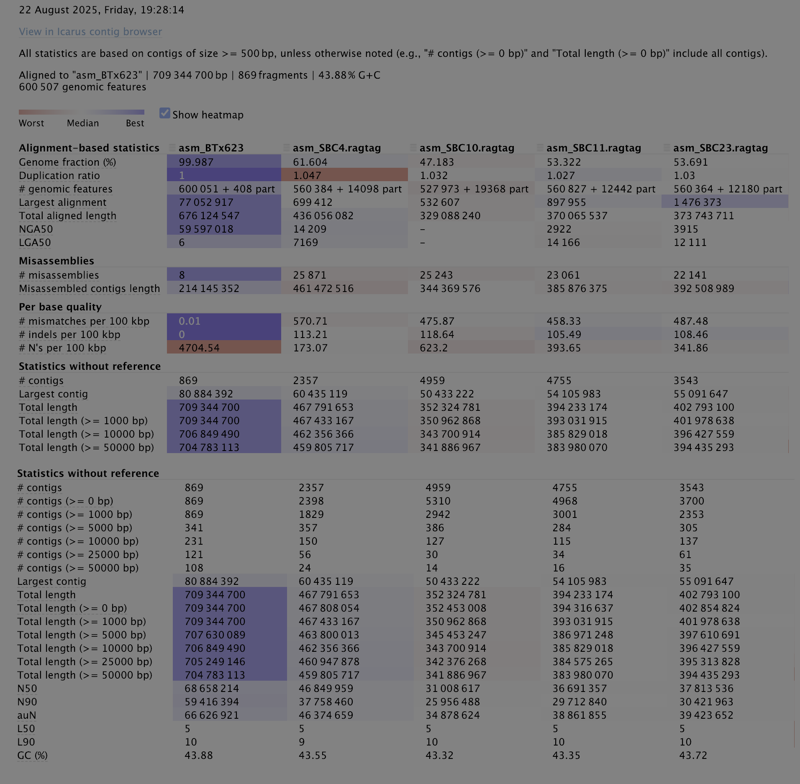

# Variant Analysis

SNP / small-indel detection from ONT reads (minimap2-aligned) against the **BTx623** reference genome.

## Samples

| Sample | BAM location |
|--------|-------------|
| SBC4   | `$bam_dir/read_SBC4.bam`  |
| SBC10  | `$bam_dir/read_SBC10.bam` |
| SBC11  | `$bam_dir/read_SBC11.bam` |
| SBC23  | `$bam_dir/read_SBC23.bam` |

BAMs were produced by:
```shell
minimap2 -a -t 36 asm_BTx623.fna read_{sample}.fq | samtools view -b | samtools sort -o read_{sample}.bam
```

## Tool chain

```
samtools index → Clair3 (run_clair3.sh) → bcftools filter → bcftools merge
```

| Step | Rule | Output |
|------|------|--------|
| Index BAMs | `index_bam` | `read_{sample}.bam.bai` |
| Call variants | `call_variants` | `results/variant_analysis/{sample}/merge_output.vcf.gz` |
| Filter VCF | `filter_vcf` | `results/variant_analysis/{sample}/{sample}_filtered.vcf.gz` |
| Merge samples | `merge_vcf` | `results/variant_analysis/all_strains_merged.vcf.gz` |

## Requirements

Install into the `sbi` conda environment:
```shell
mamba install -n sbi -c conda-forge -c bioconda samtools clair3 bcftools -y
```

### Clair3 model selection

The model **must** match the basecalling model used for your ONT run.  
Set `clair3_model` in `configs/config.yaml` to the full path of the model directory.

Download models from:
- [Clair3 pre-trained models](https://github.com/HKU-BAL/Clair3#pre-trained-models)
- [rerio](https://github.com/nanoporetech/rerio) (ONT-supported models)

## Usage

### Standalone
```shell
snakemake -c 8 \
  -s workflows/variant_analysis/Snakefile \
  --configfile configs/config.yaml
```

### Via root Snakefile
```shell
snakemake -c 8 --configfile configs/config.yaml variant_analysis_all
```

### Dry-run
```shell
snakemake -n -s workflows/variant_analysis/Snakefile --configfile configs/config.yaml
```

## Filter criteria

Hard filters applied by `bcftools filter`:
- `QUAL < 20` → remove
- `FORMAT/DP < 5` → remove
- Non-PASS records → remove

Adjust `variant_min_qual` and `variant_min_depth` in `configs/config.yaml`.

## Outputs

```
results/variant_analysis/
├── SBC4/
│   ├── merge_output.vcf.gz          ← raw Clair3 output
│   └── SBC4_filtered.vcf.gz
├── SBC10/ …
├── SBC11/ …
├── SBC23/ …
└── all_strains_merged.vcf.gz        ← 4-sample merged VCF
```

## Prototyping notebook

`workflows/variant_analysis/notebook.ipynb` — step-by-step prototype for SBC4.

## Assembly QC

